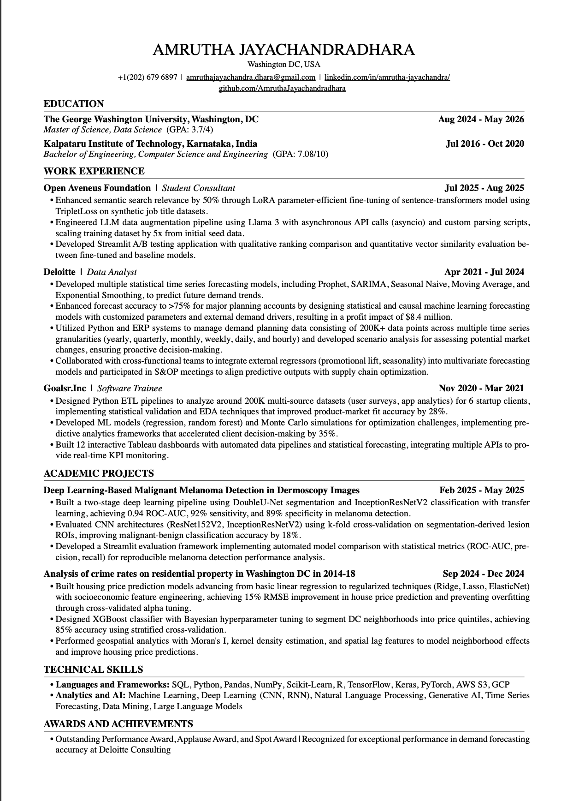

# Resume
Amrutha Jayachandradhara -  Data Science M.S. student with 3+ years of machine learning experience, excels in time series forecasting, deep learning, and Generative AI, including LLM optimization. She is proficient in the end-to-end data lifecycle and skilled in Python, SQL, TensorFlow, PyTorch, and cloud platforms like AWS and GCP.

Creating one page resume to manage the changes

<object data="Datascience_Resume_Amrutha_J.pdf" type="application/pdf" width="100%" height="800px">
    
Your browser does not support PDFs. <a href="Datascience_Resume_Amrutha_J.pdf">Download the PDF</a>.

</object>

